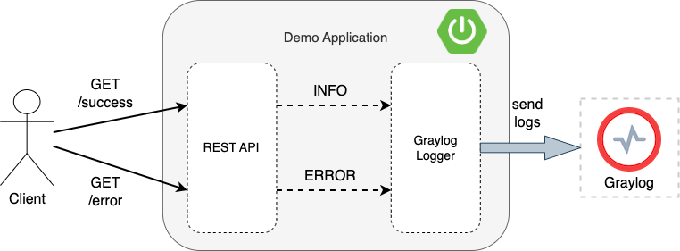
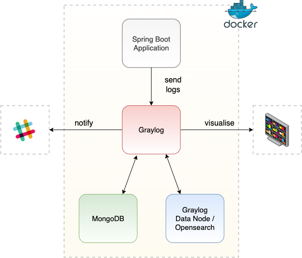
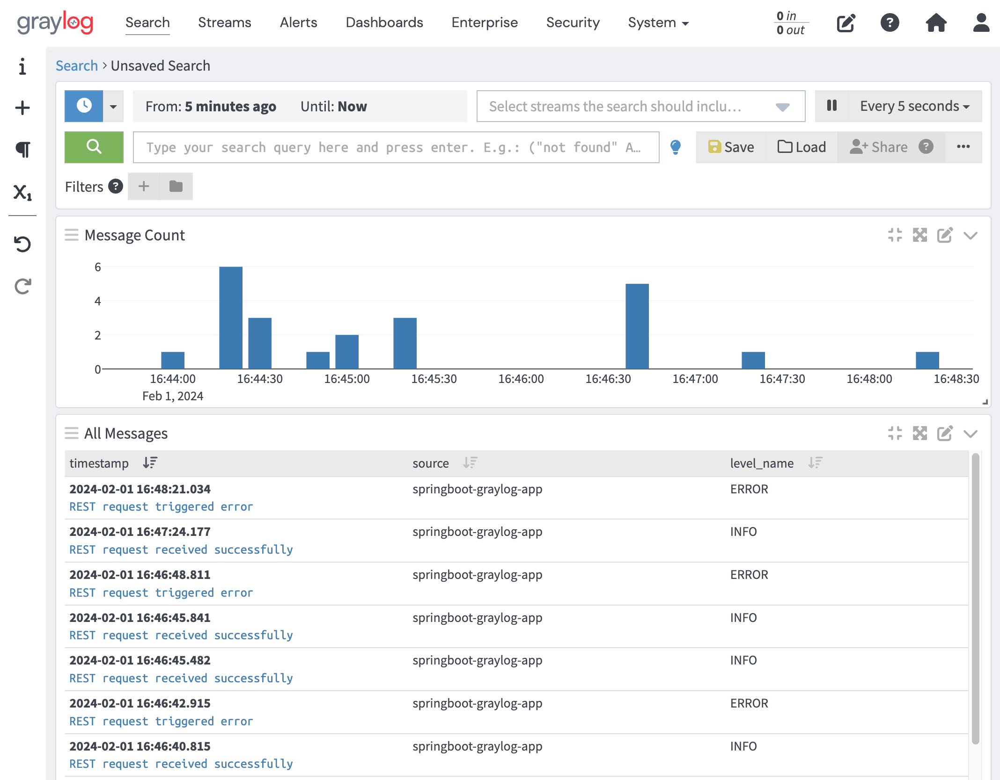

# Spring Boot Logging Demo With Graylog

Demonstrating sending logs from a Spring Boot application to Graylog.

## Graylog Demo

### Spring Boot Application

#### Overview

The Spring Boot application provides a REST API that when called will log a message.  This logging is piped through to Graylog where messages can be searched and filtered.  Alerts can be configured to notify targets such as Slack, for example when error messages are received.



## Build Application

The Spring Boot application and docker image are built:
```
mvn clean install
docker build -t springboot-graylog-app .
```

This image will be used when the docker containers are started in the next step.

## Start Docker Containers

From root dir run the following to start dockerised Graylog, Graylog Data Node (Opensearch), MongoDB (used by Graylog), and the Spring Boot application (`springboot-graylog-app`):
```
docker-compose up -d
```



## Graylog

### Graylog Setup & Login

From version 5.2, Graylog uses Graylog Data Nodes, which uses Opensearch rather than Elasticsearch.

Password secret generation (for GRAYLOG_PASSWORD_SECRET):
```
openssl rand -hex 48
```

Password generation (for GRAYLOG_ROOT_PASSWORD_SHA2):
```
echo -n admin | shasum -a 256
```

Update environment variables in `docker-compose.yml`, or use the existing values which are `admin` / `admin`.

Navigate to Graylog Web UI:
```
http://localhost:9000/
```

Login with username/password that is output in the Graylog container logs.  View the logs with:
```
docker logs -f graylog
```

For example, logging shows:
```
Initial configuration is accessible at 0.0.0.0:9000, with username 'admin' and password 'KmIvzhoGXr'.
```

Set up the certificate authority for the integration with the Graylog datanode by clicking:
`Create CA` / `Create Policy` / `Provision certificate and continue` / `Resume startup`

Now login with `admin` / `admin`.

### Graylog Input Configuration

Create Input:  `System` / `Inputs` / `Select input` Select `GELF UDP` (in line with the appender defined in the `logback.xml` appender) / `Launch new input` /  Enter name / Select `Global` checkbox / `Launch Input`.

### Graylog Log Search

View messages:  `Search`.

To display the logging level, select `FIELDS` on the left menu / `level_name` / `Add to all tables`



### Graylog Alerting

Configure a Slack webhook endpoint for the Slack workspace that will be sent alert notifications by Graylog:

https://api.slack.com/messaging/webhooks

Create a `Notification`:  `Alerts` / `Notifications` / `Create notification` / Notification Type: `Slack Notification` / `Webhook URL`: Enter generated URL / `Channel`: Required Slack channel / `Create notification`

Create an `Event Definition`: `Alerts` / `Event Definitions` / `Create event definition` / `Condition type`: `Filter & Aggregation` / `Search query`: `level: <4` / `Notifications` / `Add Notification`: Select created notification / `Create event definition`

## Generate Application Logging

Trigger an INFO message by calling:
```
curl http://localhost:9001/v1/demo/success
```

View resultant application logging in Graylog.

## Trigger Alert

Trigger an ERROR message by calling:
```
curl http://localhost:9001/v1/demo/error
```

This results in an alert notification being sent to Slack. 


## Docker Commands

Stop containers:
```
docker-compose stop
```

Manual clean up:
```
docker rm -f $(docker ps -aq)
```

Further docker clean up if network/other issues:
```
docker system prune
docker volume prune
```
