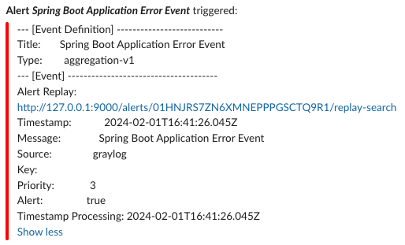

# Spring Boot Demo With Graylog

A Spring Boot application that consumes and produces messages from Kafka, generating logging as it does so.  This logging is piped through to Graylog where messages can be searched and filtered.  Alerts can be configured to notify targets such as Slack, for example when error messages are received.

## Build Application

The Spring Boot application and docker image are built:
```
mvn clean install
docker build -t springboot-graylog-app .
```

This image will be used when the docker containers are started in the next step.

## Start Docker Containers

From root dir run the following to start dockerised Graylog, Graylog datanode (Opensearch), MongoDB, Kafka, Zookeeper and the Spring Boot application (`springboot-graylog-app`):
```
docker-compose up -d
```

## Graylog

### Graylog Setup & Login

From version 5.2, Graylog uses Graylog datanodes, which use Opensearch rather than Elasticsearch.

Password secret generation (for GRAYLOG_PASSWORD_SECRET):
```
openssl rand -hex 48
```

Password generation (for GRAYLOG_ROOT_PASSWORD_SHA2):
```
echo -n admin | shasum -a 256
```

Update environment variables in `docker-compose.yml`, or use the existing values which are `admin` / `admin`.

Navigate to Graylog Web UI:
```
http://localhost:9000/
```

Login with username/password that is output in the Graylog container logs.  View the logs with:
```
docker logs -f graylog
```

For example, logging shows:
```
Initial configuration is accessible at 0.0.0.0:9000, with username 'admin' and password 'KmIvzhoGXr'.
```

Set up the certificate authority for the integration with the Graylog datanode by clicking:
`Create CA` / `Create Policy` / `Provision certificate and continue` / `Resume startup`

Now login with `admin` / `admin`.

### Graylog Input Configuration

Create Input:  `System` / `Inputs` / `Select input` Select `GELF UDP` (in line with the appender defined in the `logback.xml` appender) / `Launch new input` /  Enter name / `Launch Input`.

### Graylog Log Search

View messages:  `Search`.

### Graylog Alerting

Configure a Slack webhook endpoint for the Slack workspace that will be sent alert notifications by Graylog:

https://api.slack.com/messaging/webhooks

Create a `Notification`:  `Alerts` / `Notifications` / `Create notification` / Notification Type: `Slack Notification` / `Webhook URL`: Enter generated URL / `Channel`: Required Slack channel / `Create notification`

Create an `Event Definition`: `Alerts` / `Event Definitions` / `Create event definition` / `Condition type`: `Filter & Aggregation` / `Search query`: `error_level < 4` / `Notifications` / `Add Notification`: Select created notification / `Create event definition`

## Generate Application Logging

### Produce Kafka Inbound Event:

Produce a Kafka event to the inbound topic that results in application logging which can be observed in Graylog.

Jump onto the Kafka docker container and produce a `demo-inbound-topic` message:
```
docker exec -ti kafka kafka-console-producer \
--topic demo-inbound-topic \
--broker-list kafka:29092
```
Now enter the message:
```
{"data": "my-data"}
```
The `demo-inbound-topic` message is consumed by the application, which emits a resulting `demo-outbound-topic` message.

### Consume Kafka Outbound Event:

Check for the emitted `demo-outbound-topic` message:
```
docker exec -ti kafka kafka-console-consumer \
--topic demo-outbound-topic \
--bootstrap-server kafka:29092 \
--from-beginning
```
Output:
```
{"data":"Processed: my-data"}
```

View resultant application logging in Graylog.

## Trigger Alert

The application will log an ERROR message when it receives a message that it cannot unmarshal.

Using the `kafka-console-producer` command above, enter a message that is not in JSON.  An error is logged:
```
ERROR o.s.k.l.DefaultErrorHandler - Backoff FixedBackOff{interval=0, currentAttempts=1, maxAttempts=0} exhausted for demo-inbound-topic-0@1
2024-02-01 14:28:26 org.springframework.kafka.listener.ListenerExecutionFailedException: Listener failed
```

This results in an alert notification being sent to Slack. 



## Docker Commands

Stop containers:
```
docker-compose stop
```

Manual clean up:
```
docker rm -f $(docker ps -aq)
```

Further docker clean up if network/other issues:
```
docker system prune
docker volume prune
```
